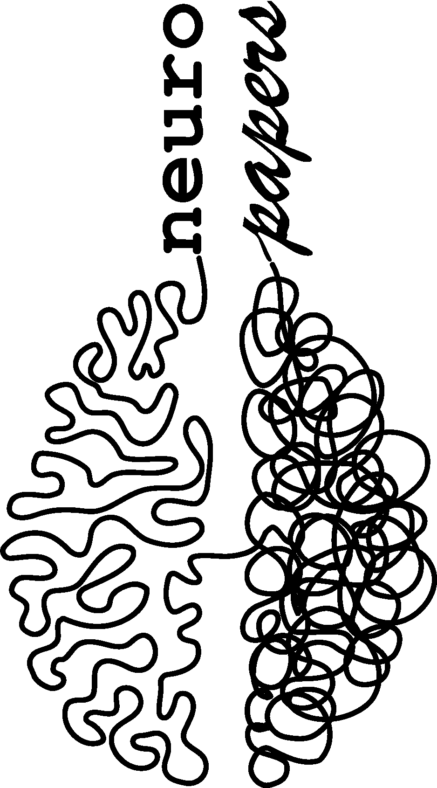

<!-- README -->
### README
<!-- PROJECT LOGO -->
<br />
<div align="center">
  <a>
    
  </a>
  <h1 align="center">neuro papers db</h1>
  <p align="center">
    2022 - 2023 Neuroscience Scientific Publications
    <br />
    <br />
    <a href="https://github.com/inesgcalvo/neuroscience_papers"><strong>Explore the docs »</strong></a>
  </p>
</div>


<!-- TABLE OF CONTENTS -->
<details>
  <summary>Table of Contents</summary>
  <ol>
    <li>
      <a href="#about-the-project">About The Project</a>
      <ul>
        <li><a href="#built-with">Built With</a></li>
      </ul>
    </li>
    <li>
      <a href="#description">Description</a>
    </li>
    <li><a href="#extraction">Extraction</a></li>
      <ul>
        <li><a href="#pubmed">PubMed</a></li>
        <li><a href="#biorxiv-api">biorXiv API</a></li>
        <li><a href="#sci-hub">sci-hub</a></li>
        <li><a href="#crossref">Crossref</a></li>
        <li><a href="#genderize-api">genderize API</a></li>
      </ul>
    <li><a href="#transformation">Transformation</a></li>
    <li><a href="#roadmap">Roadmap</a></li>
    <li><a href="#contact">Contact</a></li>
    <li><a href="#acknowledgments">Acknowledgments</a></li>
  </ol>
</details>


<!-- ABOUT THE PROJECT -->
## About The Project
The development of a comprehensive database for scientific publications in neuroscience is of utmost importance. With the rapid expansion of research in this field, a centralized repository can serve as a valuable resource for scholars, educators, and students alike. This initiative not only consolidates the existing knowledge but also paves the way for new discoveries and breakthroughs. 
<div align="center">
  <a>
    
  </a>
</div>
   <br />

The idea is to gather data from PubMed publications and enrich them with information from other sources, like Crossref. Also, collect data from biorxiv preprints. Lastly, to compile information regarding the availability of these publications on Sci-Hub.

<p align="right">(<a href="#readme">Back to top</a>)</p>

### Built With

The following Python libraries have been used for this project: 

* requests -- HTTP for Humans
* pymongo -- written for MongoDB
* selenium -- automates browsers
* nltk -- Natural Language Toolkit

<p align="right">(<a href="#readme">Back to top</a>)</p>

 <!-- DESCRIPTION -->
## Description
A scientific article often contains several key elements that contribute to its credibility and accessibility. These elements include a Digital Object Identifier (**DOI**) for precise identification and referencing, a clear and concise **title** that succinctly reflects the content of the study, a list of **authors** indicating the individuals responsible for the research, their **affiliations**, and their respective institutional or organizational affiliations. The article also typically includes information about the **journal** in which it is published, such as the journal's name, publication **year**, and **month**, along with the specific **volume** and **page** numbers where the article can be found. In addition, some articles may include unique identifiers such as PubMed ID (**PMID**) and PubMed Central ID (**PMCID**) for efficient retrieval in relevant databases. Moreover, a comprehensive **abstract** summarizing the main objectives, methodologies, findings, and implications of the study is often provided to give readers a quick overview of the research's key points.

<p align="right">(<a href="#readme">Back to top</a>)</p>


<!-- USAGE EXAMPLES -->
## Extraction
For the creation of this database, a diverse range of sources has been utilized to ensure comprehensive and robust data compilation. These sources encompass various reliable online repositories, and authoritative databases within the field.

### PubMed
PubMed is a free-access database that houses a vast collection of bibliographic references and abstracts of research articles in the fields of biomedicine and health.

https://pubmed.ncbi.nlm.nih.gov/

### biorXiv API
bioRxiv is a free online archive and distribution service for unpublished preprints in the life sciences. bioRxiv provides an API (Application Programming Interface) that allows developers to access and retrieve data programmatically from the bioRxiv server, enabling seamless integration of preprint information into various applications and workflows.

1. Read the documentation [https://api.biorxiv.org/](https://api.biorxiv.org/)
2. Prepare the url:
   ```
    https://api.biorxiv.org/details/[server]/[interval]/[cursor]/[format]
   ```
    - Server: biorxiv
    - Intervals: 
    ```
    ['2022-01-01/2022-12-31',
    '2023-01-01/2023-12-31']
    ```
    - Format: json

### sci-Hub
Sci-Hub is a controversial online repository that provides free access to a vast collection of academic articles, including those behind paywalls, bypassing traditional copyright and subscription barriers.

https://sci-hub.se/database 

### Crossref
Crossref is a not-for-profit organization providing a comprehensive metadata infrastructure that facilitates the discovery and linking of scholarly content. Through its extensive network, Crossref collects and distributes rich metadata, including bibliographic information, citations, and persistent identifiers, thereby enhancing the visibility, accessibility, and interoperability of academic and professional research publications.

https://search.crossref.org/

### genderize API
Determine the gender of a name. A simple API to predict the gender of a person given their name. The API is free for up to 1000 names/day. No sign up or API key needed.

```
https://api.genderize.io?name=peter

{
  "name": "peter",
  "gender": "male",
  "probability": 0.99,
  "count": 165452
}
```
https://genderize.io/

<p align="right">(<a href="#readme">Back to top</a>)</p>

<!-- TRANSFORMATION -->
## Transformation
Data cleansing in pandas involves the process of detecting and rectifying any inconsistencies, inaccuracies, or anomalies within a dataset. Leveraging functionalities such as data filtering, handling missing values, and identifying outliers, data cleansing ensures the accuracy and reliability of the dataset.

<p align="right">(<a href="#readme">Back to top</a>)</p>

<!-- ROADMAP -->
## Roadmap

- [x] PubMed publications extraction with selenium
- [x] Biorxiv API preprint 
- [x] Crossref 'href' and 'json_href' extraction with selenium
- [x] Data Cleansing
- [ ] Genderize the names of the first and last authors.
    - [x] First authors
    - [ ] Last authors
- [x] Data Analytics
- [ ] Queries for MongoDB

<p align="right">(<a href="#readme">Back to top</a>)</p>

<!-- CONTACT -->
## Contact

* [My GitHub](https://github.com/inesgcalvo)
* [My LinkedIn](https://www.linkedin.com/in/ines-g-calvo/)
* [My Website](http://inesgcalvo.byethost31.com/)

<p align="right">(<a href="#readme">Back to top</a>)</p>

<!-- ACKNOWLEDGMENTS -->
## Acknowledgments

I am sincerely grateful for the unwavering support and guidance provided by my esteemed professors: Yona, Carlos, JeanCha, Rosella and Jaime. Their dedication to nurturing their students' intellectual growth and fostering an environment of learning has profoundly impacted my educational journey. With their mentorship, I have not only gained invaluable knowledge but also developed a deeper appreciation for the subjects they taught. I extend my heartfelt appreciation to them for their commitment and passion for education.

* [Yona](https://github.com/YonatanRA)
* [Carlos](https://github.com/CharlyKill7)
* [Jean-Cha](https://github.com/yamadajc)
* [Rosella](https://github.com/rmanzi13)
* [Jaime](https://github.com/RCJaime)

<p align="right">(<a href="#readme">Back to top</a>)</p>